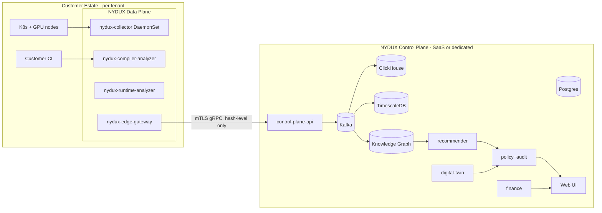

# RFC-001 — Overall Architecture

**Status:** Approved · **Extends:** V1 Phase 3 (Four-Layer Model), Phase 4 (Product Architecture), Phase 5 (Engineering Design)
**Owns Section A:** Enterprise, Logical, Physical, Deployment, Reference, HA, DR, Networking, Security(overview→RFC-009), Cloud, On-Prem, Hybrid, Edge, Air-Gapped.

## A.1 Enterprise Architecture (context)
NYDUX splits into a **customer-resident Data Plane (DP)** and a **NYDUX-operated Control Plane (CP)**. This split is the enterprise architecture: raw IR, SASS, traces, and prompts never leave the tenant boundary (V1 Phase 5, OQ-14). Only hash-level features, aggregates, and control messages cross it.

## A.2 Logical Architecture
Layered exactly as V1 Phase 3; each layer is realized by services (RFC-014 catalog):
- Infrastructure layer → `collector`, `infra-svc`
- Runtime layer → `runtime-analyzer`, `nccl-svc`
- Compiler layer → `compiler-analyzer`, `kernel-registry`, `regression-svc`, `recommender`
- Business layer → `finance-svc`, `savings-svc`, `chargeback-svc`
- Cross-cutting → `policy-svc`, `audit-svc`, `graph-svc`, `twin-svc`, `agent-orchestrator`, `auth-svc`, `tenant-svc`, `notify-svc`, `edge-gateway`, `control-plane-api`.

**Dependency rule (binding):** dependencies point downward only: UI → API → domain services → stores/bus. Domain services never call the API tier. Compiler layer never depends on finance. Enforced by import-linting (RFC-012 §O.6) and network policy (A.8).

## A.3 Physical Architecture
- CP reference deployment: 3 AZs, Kubernetes 1.30+, node pools: `general` (API/domain, c-class), `analytics` (ClickHouse, i-class NVMe), `stateful` (PG/Timescale/Kafka, m-class + EBS-gp3/io2), `ml` (embeddings/agents, 1×L4-class GPU optional).
- DP reference: DaemonSet on every GPU node (collector, ≤200m CPU/256Mi steady-state budget); 1–3 analyzer pods per cluster (8 vCPU/32Gi, HPA on queue depth); edge-gateway Deployment ×2.
- Sizing anchors: collector overhead ≤1% node CPU at 10s DCGM cadence; ClickHouse plan 30–60 bytes/row post-compression for counters (RFC-007 §C.4).

## A.4 Deployment Architecture (profiles)
| Profile | Control Plane | Data Plane | Bus | Notes |
|---|---|---|---|---|
| SaaS (default) | NYDUX multi-tenant | in-tenant | Kafka (CP) + NATS (DP-local) | hash-level egress only |
| Dedicated | single-tenant CP in NYDUX cloud | in-tenant | same | contractual isolation |
| Self-hosted | CP in customer cloud/on-prem | same cluster or peered | Kafka or Redpanda | NYDUX ships Helm+Operator |
| Air-gapped | fully offline | co-located | Redpanda single/3-node | see A.13 |
Install: `helm install nydux nydux/platform -f profile-<name>.yaml`; the `nydux-operator` reconciles CRDs `NyduxCluster`, `NyduxCollector`, `NyduxPolicy`, `NyduxBaseline`.

## A.5 Reference Architecture (golden path, GA scope)
EKS/GKE/AKS + NVIDIA GPU Operator + DCGM-exporter → collector → edge-gateway → CP SaaS. vLLM/SGLang metrics scraped; Triton/Inductor IR captured via SDK hook or CI plugin; Nsight Compute invoked on-demand by analyzer in-tenant. Everything else is a documented deviation.

## A.6 High Availability
- CP SLO: API 99.9% monthly; ingest 99.95% (buffered, so user-visible loss requires >4h outage).
- Stateless tiers: ≥3 replicas, PDB minAvailable=2, multi-AZ topology spread.
- Kafka RF=3, min.insync=2, acks=all. ClickHouse: 2 replicas/shard via Keeper. PG/Timescale: Patroni, sync replica in-region + async cross-region. Redis: cluster mode, AOF everysec.
- DP degrades gracefully: gateway offline ⇒ collectors spool to local disk ring buffer (default 24h, configurable) then backfill with original event timestamps (RFC-005 §B.7).

## A.7 Disaster Recovery
Targets (V1 Phase 5 confirmed): **RPO ≤5 min, RTO ≤1 h** for CP.
- PG/Timescale: WAL-G continuous archiving to object storage, PITR; restore drill monthly (automated, RFC-011 §J.10).
- ClickHouse: replicated + daily `BACKUP TO S3` incremental; counters also replayable from Kafka (retention 7d) — dual recovery path.
- Kafka: MirrorMaker2 to DR region (async).
- Graph (PG+AGE): covered by PG PITR. Object storage: versioned + cross-region replication.
- Runbook `RB-DR-001`: promote DR region: (1) freeze writes via API read-only flag, (2) promote PG replica, (3) repoint ClickHouse ingest to mirrored topics, (4) DNS failover (60s TTL), (5) verify audit-chain continuity check passes before re-enabling writes.

## A.8 Networking Architecture
- All service-to-service: mTLS via mesh (Linkerd chosen: lighter than Istio; tradeoff: fewer L7 policies — acceptable, L7 authz lives in services).
- DP→CP: single egress FQDN `ingest.<region>.nydux.ai:443` gRPC/h2; static egress IPs published for firewall allowlists; proxy support (HTTPS_PROXY) mandatory in collectors.
- Default-deny NetworkPolicies in both planes; only edge-gateway may egress.
- No customer-network inbound to DP ever required (pull-config via long-poll/stream from gateway outward).

## A.9 Security Architecture — summary
Zero-trust, tenant-scoped keys, hash-only egress, signed artifacts, hash-chained audit. Full treatment: RFC-009.

## A.10 Cloud Architecture
Terraform modules per cloud (`infra/aws|gcp|azure`); managed K8s + managed PG where available; ClickHouse self-managed on NVMe (managed CH acceptable alternative, flag `storage.clickhouse.managed`). Cloud marketplace images track the same Helm chart digest.

## A.11 On-Prem Architecture
Self-hosted profile; hard requirements: K8s ≥1.28, default StorageClass with RWO SSD, LoadBalancer or NodePort ingress, NTP. No internet assumed except license activation (offline license file supported).

## A.12 Hybrid & Edge
Hybrid = CP SaaS + multiple DPs across clouds/on-prem; each DP registers with a `cluster_id`, all attribution keyed by (tenant, cluster). Edge (small inference sites): a `collector-lite` static binary (no K8s) shipping via the same gateway protocol; analyzer functions run centrally on uploaded fingerprints only.

## A.13 Air-Gapped Architecture
- Bundle: `nydux-airgap-<ver>.tar` = container images (signed, cosign), Helm charts, license, CVE feed snapshot, model weights for local embedder, docs.
- Bus: Redpanda (OQ-04). Graph aggregation to the global Knowledge Graph is DISABLED; a local-only graph runs; optional one-way "sneakernet export" of hash-level features via reviewed, signed export files (customer-initiated, dual-approval, audit-logged).
- Updates quarterly via bundle; CRI reference DB updated in same bundle so regression detection still works offline.

## A.14 Failure-mode table (plane-level)
| Failure | Blast radius | Detection | Mitigation |
|---|---|---|---|
| CP region down | dashboards/recs delayed; DP unaffected | synthetic probes | DR runbook A.7 |
| Gateway↔CP link down | telemetry delayed | gateway heartbeat gap | disk spool + backfill |
| Kafka partition unavailable | one topic-partition lag | consumer lag alerts | RF=3 failover |
| ClickHouse shard loss | query gaps for shard range | replica health | replica promote + Kafka replay |
| Analyzer crash-loop | new kernels unscored | pod restarts alert | measurement-only mode; hash-cache serves known kernels |
