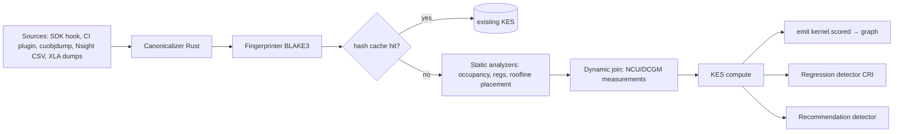

# RFC-002 — Compiler Intelligence Engine

**Status:** Approved · **Extends:** V1 Phase 6, Phase 4.2 · **Owns:** Section E algorithms KES, CRI, Compiler Recommendation, kernel-level Root Cause Analysis; ingestion pipeline; parser matrix.

## 2.1 Scope & Non-Goals
In scope: IR/PTX/SASS ingestion, canonicalization, kernel identity, KES, CRI, fusion/quantization opportunity detection, recommendation generation, RCA at kernel granularity. Non-goals: cluster-level RCA (RFC-004/008), autonomous code changes (RFC-008, human-gated).

## 2.2 Pipeline

All heavy parsing in-tenant (`compiler-analyzer`); only features + scores egress (RFC-001 A.1).

## 2.3 Parser Matrix (versioned, OQ-05)
| Artifact | Tool/lib | Versions supported at GA |
|---|---|---|
| Triton TTIR/TTGIR | vendored MLIR parsers per Triton tag | 2.3–3.x pinned set |
| TorchInductor FX | torch.fx serializer | torch 2.3–2.6 |
| XLA HLO/StableHLO | hlo_proto | current stable |
| LLVM-IR | llvm-py / llvm-c | LLVM 17–19 |
| PTX | in-house Rust parser (grammar from PTX ISA doc) | ISA 7.x–8.x |
| SASS | in-house Rust decoder over `cuobjdump -sass` text; opcode tables per arch (sm_80/86/89/90/100) | best-effort (OQ-01) |
Unknown version ⇒ `MEASUREMENT_ONLY` status on the kernel record; UI badges it; KES confidence ≤0.4.

## 2.4 Kernel Identity & Canonicalization
`kernel_hash = BLAKE3(canonical_ir)` where canonicalization: strip comments/metadata/debug locs; alpha-rename SSA values (`%0..%n` in def order); sort commutative operand pairs; normalize constant formatting; embed {arch, triton_ver?, launch_bounds}. Two kernels equal-by-math but differently named collide → intended (dedup). Distinct arch ⇒ distinct hash (SASS differs). Edge case: data-dependent specialization (autotuned tile sizes) ⇒ hash per config; `kernel_family_hash` = hash minus tunable params groups them.

## 2.5 Kernel Efficiency Score (KES) — full algorithm
**Definition.** KES ∈ [0,100], explainable weighted geometric mean of component sub-scores, each ∈ (0,1]:

```
KES = 100 · Π_i s_i^{w_i},  Σ w_i = 1
components (default weights):
 s_roof (0.30): achieved_perf / roofline_bound(AI)
   AI = FLOPs / bytes_moved;  bound = min(peak_flops, AI · peak_bw)
 s_occ  (0.15): achieved_occupancy / max_theoretical_occupancy(regs, smem, block)
 s_stall(0.20): 1 − stall_frac_avoidable   (scoreboard long/short, barrier; excludes unavoidable dependency stalls per NCU taxonomy)
 s_mem  (0.15): coalescing = sectors_ideal / sectors_actual (global) · l2_hit_weighting
 s_tc   (0.10): tensor_pipe_active / tensor_pipe_possible (1.0 if op has no MMA equivalent — detected from IR op mix)
 s_mix  (0.10): 1 − wasted_instr_frac (predicated-off lanes, replays, spills: LDL/STL presence penalized)
```
Geometric mean chosen over arithmetic: a kernel that is perfect on 5 axes but 5%-coalesced must score low (multiplicative pain matches physics). Tradeoff: harsher, less intuitive; mitigated by per-component display.
**Static vs dynamic:** with NCU measurements, all components measured (confidence 0.9–1.0). Static-only (CI pre-merge): s_occ, s_mix, partial s_mem from access-pattern analysis; s_roof from analytical FLOP/byte counts; confidence 0.4–0.6 and labeled `STATIC_ESTIMATE`.
**Complexity:** O(instr) per kernel; NCU replay dominates wall time (seconds) — hence hash cache.
**Edge cases:** (1) tiny kernels (<10µs): launch overhead dominates — KES suppressed, kernel flagged `FUSION_CANDIDATE` instead; (2) memory-bound-by-design ops (decode GEMV): s_tc weight redistributed to s_mem (weight profile `decode`); weight profiles {training, prefill, decode, hpc} selected from runtime context; (3) multi-kernel graphs: per-kernel KES + time-weighted workload KES.
**Calibration:** weights fit per-arch by regressing KES against measured throughput on the internal benchmark corpus (≥50 kernels V1 Stage-0 tripwire); refit quarterly; weight versions recorded (`kes_model_version`) so scores are reproducible.
**Failure modes:** NCU unavailable (prod perms) → static+DCGM-coarse mode; counter skew across driver versions → per-driver normalization table.

## 2.6 Compiler Regression Index (CRI)
**Goal:** detect when toolchain change (CUDA/ptxas/Triton/torch) degrades a kernel or fleet, per Yoshida-2024 mechanisms (unrolling, scheduling, host compiler).
**Per-kernel:** for kernel family f, versions v1→v2:
```
Δperf(f) = (t_v2 − t_v1)/t_v1           (measured, matched shapes, n≥5 runs, median)
CRI_kernel(f) = max(0, Δperf) · sev(f)   sev = time_share_of_workload
regression if Δperf > max(0.03, 2·σ_noise(f))   # σ from historical run variance
```
**Static pre-screen (no run needed):** IR/SASS diff features — unroll factor delta, spill count delta, instruction count delta, occupancy delta — feed logistic classifier P(regression); P>0.7 triggers targeted benchmark run. Classifier trained on labeled corpus (Knowledge Graph); prior art anchored to Yoshida-2024.
**Fleet CRI:** `CRI = Σ_f CRI_kernel(f)` over time-weighted top-95% kernels ⇒ interpretable as "fractional throughput at risk". CI gate: `nydux regressions --fail-on CRI>0.10` (RFC-006 CLI).
**Ordering/idempotency:** comparisons keyed (family, v1, v2, arch, shape_class); re-runs upsert.
**Edge cases:** shape drift between versions ⇒ compare within shape_class buckets (log-scale dims); nondeterministic kernels (atomics) ⇒ widen σ; new-kernel-no-baseline ⇒ excluded from CRI, listed as "unbaselined".

## 2.7 Recommendation Detection
Pattern library (initial 12, extensible via plugin API RFC-014):
1. Unfused elementwise chain (≥3 pointwise ops sharing producer/consumer in FX/HLO graph) → fused Triton kernel; expected gain from graph priors (Liger-class).
2. Missing FlashAttention (attention pattern matched in FX; naive softmax-matmul detected).
3. Low occupancy from register pressure (regs > threshold(arch), spills>0) → `maxnreg`/tiling suggestion.
4. Non-coalesced global access (stride pattern from IR index math) → layout/transpose suggestion.
5. FP32 GEMM on TC-capable arch → BF16/FP8 with accuracy-risk flag (quantization estimator RFC-004 links).
6. Small-batch GEMM stream → batched/persistent kernel.
7. Excess kernel launches (>N launches <10µs each per step) → CUDA Graphs / fusion.
8. Suboptimal Triton tile config vs autotune table for arch.
9. cuBLAS algo fallback detected (heuristic log) → explicit algo pin.
10. Sync-heavy NCCL overlap gap (from runtime layer join) → comm/compute overlap.
11. Old toolchain with known-fixed regression (CRI reference DB) → upgrade rec.
12. Known-regressing toolchain for this pattern → hold-back rec.
Each rec emitted with: pattern_id, evidence refs (IR spans, counters), expected_gain_pct (P50/P90 from graph), confidence, effort_estimate, and a machine-applicable patch when safe (Triton source rewrite) else human instructions. Ranking in RFC-003 §D.7.

## 2.8 Kernel-level Root Cause Analysis
Deterministic decision tree first (explainable), agent only as narrator (RFC-008):
```
if s_roof high and wallclock high → launch/overhead problem (check launches, graphs)
elif AI < ridge and s_mem low → memory bound + inefficient access → coalescing/layout branch
elif AI ≥ ridge and s_tc low → compute bound, tensor cores idle → precision/MMA branch
elif s_occ low → resource limits branch (regs/smem/block)
elif s_stall high → dependency/latency branch (ILP, software pipelining)
```
Output: ordered cause list with counter evidence. Tested via golden-kernel suite: 30 deliberately broken kernels with known causes; tree must top-1 ≥90%.

## 2.9 Testing & Benchmarks
- Parser fuzzing (cargo-fuzz) on PTX/SASS grammars; corpus from public kernels.
- Golden IR fixtures per supported version (snapshot tests) — parser drift breaks CI loudly.
- KES reproducibility test: same kernel, 10 runs, KES stddev <2 points.
- Perf budget: analyzer p95 <2s/kernel static, <30s with NCU replay (assumption A11 validation, Sprint 3).

## 2.10 Failure Modes & Recovery
| Failure | Behavior |
|---|---|
| Unknown IR version | MEASUREMENT_ONLY, alert, parser-matrix ticket auto-filed |
| NCU permission denied | static mode, doc link surfaced to user |
| Hash-cache poisoning (bad score cached) | scores versioned by kes_model_version; recompute job on model bump |
| ptxas/cuobjdump missing in image | init-container preflight fails install with actionable error |
