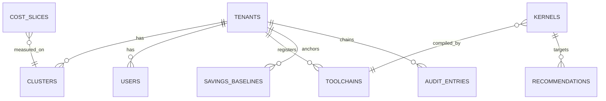

# RFC-007 — Database Schema

**Status:** Approved · **Extends:** V1 Phase 5.3 · **Owns Section C** entirely. Graph schema lives in RFC-003.

## C.1 Store responsibilities (recap, binding)
Postgres = transactional truth (tenants, users, policies, recs, toolchains, audit index). Timescale = cost & business time-series. ClickHouse = high-cardinality telemetry + kernel analytics. PG+AGE = graph. pgvector = embeddings. Redis = cache/ratelimit/queues-light. Blob = raw IR/traces (in-tenant), backups, exports.

## C.2 Postgres (control plane) — DDL (authoritative excerpt)
```sql
create table tenants (
  tenant_id uuid primary key, name text not null, plan text not null,
  region text not null, created_at timestamptz not null default now(),
  status text not null check (status in ('active','suspended','offboarding')));

create table clusters (
  cluster_id uuid primary key, tenant_id uuid not null references tenants,
  display_name text, provider text, topology jsonb, created_at timestamptz default now());
create index on clusters (tenant_id);

create table users (
  user_id uuid primary key, tenant_id uuid not null references tenants,
  email citext not null, idp_sub text not null, unique (tenant_id, email));
create table roles (role_id uuid primary key, tenant_id uuid, name text, permissions jsonb);
create table user_roles (user_id uuid references users, role_id uuid references roles,
  scope jsonb default '{}', primary key (user_id, role_id));

create table api_keys (key_id uuid primary key, tenant_id uuid not null,
  hash bytea not null, prefix text not null, scopes text[] not null,
  created_by uuid, expires_at timestamptz, revoked_at timestamptz);
create unique index on api_keys (prefix);

create table toolchains (
  toolchain_id uuid primary key, tenant_id uuid not null,
  name text not null, cuda_ver text, ptxas_ver text, triton_ver text,
  torch_ver text, host_cc text, fingerprint text not null,
  approval text not null default 'unreviewed'
    check (approval in ('unreviewed','approved','revoked')),
  approved_by uuid, approved_at timestamptz,
  unique (tenant_id, fingerprint));

create table kernels (          -- registry index; features live in ClickHouse/graph
  kernel_hash text primary key check (kernel_hash ~ '^[a-f0-9]{64}$'),
  tenant_id uuid not null, family_hash text not null, arch text not null,
  status text not null check (status in ('SCORED','STATIC_ESTIMATE','MEASUREMENT_ONLY')),
  kes numeric(5,2), kes_model_version text, confidence numeric(3,2),
  first_seen timestamptz not null, last_seen timestamptz not null);
create index on kernels (tenant_id, family_hash);
create index on kernels (tenant_id, kes) where status='SCORED';

create table recommendations (
  rec_id uuid primary key, tenant_id uuid not null,
  kernel_hash text references kernels, pattern_id text not null,
  gain_p50 numeric, gain_p90 numeric, confidence numeric(3,2),
  effort text, risk numeric, state text not null default 'created'
    check (state in ('created','approved','rejected','applied','verified','failed','rolled_back')),
  evidence jsonb not null, patch_uri text,        -- in-tenant blob ref
  created_at timestamptz default now(), decided_by uuid, decided_at timestamptz);
create index on recommendations (tenant_id, state, created_at desc);

create table policies (policy_id uuid primary key, tenant_id uuid not null,
  name text, rego text not null, enforcement text check (enforcement in ('block','warn','audit')),
  version int not null default 1, updated_at timestamptz default now());

create table audit_entries (   -- index; canonical chain also in object storage
  seq bigint not null, tenant_id uuid not null,
  entry_hash bytea not null, prev_hash bytea not null,
  actor text not null, action text not null, subject jsonb not null,
  at timestamptz not null default now(),
  primary key (tenant_id, seq));

create table savings_baselines (baseline_id uuid primary key, tenant_id uuid not null,
  version int not null, frozen_state jsonb not null, twin_model_version text not null,
  anchored_at timestamptz not null, cosign_customer uuid, cosign_nydux uuid,
  reanchor_reason text, unique (tenant_id, version));

create table jobs (job_id uuid primary key, tenant_id uuid, kind text, state text,
  request jsonb, result_uri text, created_at timestamptz default now(), finished_at timestamptz);
```
All tenant tables get RLS: `create policy t_iso on <tbl> using (tenant_id = current_setting('nydux.tenant')::uuid);` — services set GUC per request; superuser paths forbidden in app roles. Migrations: golang-migrate, forward-only, every migration has a tested `--dry-run` and a rollback note (RFC-011 §J.5).

## C.3 TimescaleDB (business time-series)
```sql
create table cost_slices (
  time timestamptz not null, tenant_id uuid not null, slice_id uuid not null,
  cluster_id uuid, team_id uuid, model_id text, workload_id text,
  usd numeric(14,6) not null, basis text not null,   -- ondemand|commit|spot|amortized
  gpu_hours numeric, tokens bigint);
select create_hypertable('cost_slices','time', chunk_time_interval => interval '1 day');
create index on cost_slices (tenant_id, team_id, time desc);
alter table cost_slices set (timescaledb.compress, timescaledb.compress_segmentby='tenant_id,team_id');
select add_compression_policy('cost_slices', interval '7 days');
select add_retention_policy('cost_slices', interval '25 months');
-- continuous aggregates: cost_daily_by_team, cost_daily_by_model, unit_cost_daily
```
Savings tables mirror pattern. Continuous aggregates refresh with 6h lag (RFC-005 B.7 watermark).

## C.4 ClickHouse (telemetry + kernel analytics)
```sql
CREATE TABLE gpu_samples (
  ts DateTime64(3), tenant LowCardinality(String), cluster LowCardinality(String),
  gpu_uuid String, node LowCardinality(String), pod String, ns LowCardinality(String),
  sm_util Float32, mem_util Float32, mem_used_mb UInt32, power_w Float32,
  temp_c Float32, sm_clock UInt16, pcie_tx_mb Float32, nvlink_tx_mb Float32,
  tensor_active Float32, dram_active Float32, xid UInt16 DEFAULT 0)
ENGINE = ReplicatedMergeTree
PARTITION BY toYYYYMMDD(ts)
ORDER BY (tenant, cluster, gpu_uuid, ts)
TTL toDateTime(ts) + INTERVAL 14 DAY TO VOLUME 'cold',
    toDateTime(ts) + INTERVAL 90 DAY DELETE
SETTINGS index_granularity = 8192;
-- rollups via materialized views: gpu_samples_1m, _1h (AggregatingMergeTree), retained 25 months

CREATE TABLE kernel_events (
  ts DateTime64(3), tenant LowCardinality(String), kernel_hash FixedString(64),
  family_hash FixedString(64), arch LowCardinality(String),
  toolchain_fp String, kes Float32, comp Map(String,Float32),
  status Enum8('SCORED'=1,'STATIC'=2,'MEAS_ONLY'=3), confidence Float32,
  dur_us Float64, launches UInt32)
ENGINE = ReplicatedMergeTree PARTITION BY toYYYYMM(ts)
ORDER BY (tenant, family_hash, kernel_hash, ts);

CREATE TABLE serving_metrics (...) ORDER BY (tenant, cluster, deploy, ts); -- ttft/tpot/batch/kv
```
Row policies per tenant (OQ-12); async_insert on; all inserts via Kafka engine tables or clickhouse-kafka-connect (exactly-once via keeper offsets).

## C.5 Redis
Keyspaces: `rl:{tenant}:{principal}` token buckets (TTL 60s); `cache:kes:{hash}` (TTL 24h, invalidated on kes_model_version bump via pubsub); `sess:` none (JWT stateless); `lock:` redlock for baseline re-anchor single-flight. Eviction: volatile-lru; nothing durable ever lives only in Redis.

## C.6 Blob storage layout
```
s3://nydux-<tenant>/ir/<kernel_hash>/{ttir,ttgir,llvm,ptx,sass}.zst   (IN-TENANT bucket only)
s3://nydux-<tenant>/traces/<job_id>/...
s3://nydux-cp/exports/<tenant>/<export_id>.tar.zst.sig
s3://nydux-cp/backups/{pg,ch,graph}/...
```
Lifecycle: ir 12mo→IA→delete 24mo (tenant-configurable); traces 90d; backups per DR policy (RFC-001 A.7). All objects SSE-KMS with tenant key (RFC-009).

## C.7 ER overview (mermaid)


## C.8 Retention summary
| Data | Hot | Total | Basis |
|---|---|---|---|
| GPU samples raw | 14d | 90d (rollups 25mo) | cost vs forensic value |
| Kernel events | — | 25mo | regression history |
| Cost/savings | — | 25mo compressed | 2 fiscal years |
| Audit | — | ≥7y (chain in blob) | compliance; EU AI Act ≥6mo minimum far exceeded |
| Raw IR (in-tenant) | 12mo | 24mo | customer configurable |
