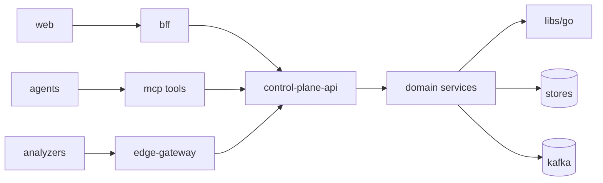

# ECD-001 — Repository Construction Plan

**Level:** 2 (extends RFC-011 §J.1, RFC-012 §O.2/O.3/O.6, RFC-014 §G.2). **Authority:** never modifies Level 1.
**Assumption register for this ECD:** ASM-001-1: RFC-011 J.1 names four repos; ECD fixes exact org path `github.com/nydux`. ASM-001-2: RFC-012 O.1 references `make` targets; ECD standardizes GNU Make ≥4.4 as the single build entrypoint wrapping language-native tools (chosen over Bazel: hermetic-enough via locked containers per RFC-009 I.9; Bazel rejected for solo-founder ops cost; revisit at >30 engineers — recorded, not TBD).

## 1. Repositories (4, per RFC-011 J.1 — no additions)
| Repo | Purpose | Languages | Default branch | Protection |
|---|---|---|---|---|
| `nydux/platform` | monorepo: services, analyzers, agents, web, proto, charts-dev, infra | Go 1.23.4 / Rust 1.80.1 / Python 3.12.6 / TS 5.5.4 | `main` | 1 reviewer; 2 for CODEOWNERS-flagged paths (RFC-011 Q) |
| `nydux/sdk-python` | public SDK | Python | `main` | same |
| `nydux/helm-charts` | customer-facing charts (published) | YAML/Go tmpl | `main` | 2 reviewers always |
| `nydux/docs` | docs site + RFCs mirror | MD | `main` | 1 reviewer |
Toolchain versions above are PINNED (`.tool-versions`, mise). Upgrades are ordinary PRs touching that file only.

## 2. Complete `nydux/platform` tree (normative; Claude Code creates exactly this)
```
platform/
├── CLAUDE.md                         # verbatim RFC-012 O.1 content
├── Makefile                          # single entrypoint (targets §6)
├── .tool-versions  .editorconfig  .gitattributes  .gitignore
├── repository.yaml                   # machine manifest (§8)
├── buf.yaml  buf.gen.yaml            # proto toolchain (buf v1.42)
├── proto/nydux/
│   ├── common/v1/{envelope.proto,error.proto,pagination.proto,types.proto}
│   ├── compiler/v1/{kernel.proto,score.proto,regression.proto,artifacts.proto}
│   ├── runtime/v1/{serving.proto,nccl.proto,job.proto}
│   ├── infra/v1/{gpu.proto,node.proto,cluster.proto,rates.proto}
│   ├── finance/v1/{cost.proto,savings.proto,baseline.proto}
│   ├── graph/v1/{query.proto,entities.proto}
│   ├── rec/v1/{recommendation.proto,verify.proto}
│   ├── policy/v1/{policy.proto,decision.proto,toolchain.proto}
│   ├── audit/v1/audit.proto
│   ├── twin/v1/{scenario.proto,result.proto}
│   ├── agent/v1/{task.proto,tool.proto}
│   └── gateway/v1/ingest.proto
├── services/                         # Go; one dir per RFC-014 G.1 service (names EXACT)
│   ├── control-plane-api/
│   ├── kernel-registry/
│   ├── regression-svc/
│   ├── bench-runner/                 # also runs verify (RFC-014 row bench/verify-runner)
│   ├── recommender/
│   ├── graph-svc/
│   ├── finance-svc/
│   ├── savings-svc/
│   ├── twin-svc/
│   ├── policy-svc/
│   ├── audit-svc/
│   ├── notify-svc/
│   ├── tenant-svc/
│   ├── auth-svc/
│   ├── ch-sink/
│   └── ts-sink/
│   # each service dir uses the O.2 layout verbatim:
│   # cmd/<name>/main.go · internal/{domain,ports,adapters/{pg,ch,kafka,redis,http,grpc},config}
│   # api/ (generated) · migrations/ · dashboards/ · alerts/ · runbook.md · Dockerfile · service.yaml
├── analyzers/                        # Rust workspace (Cargo.toml workspace root here)
│   ├── collector/                    # DP DaemonSet
│   ├── edge-gateway/                 # DP egress + privacy filter
│   ├── compiler-analyzer/            # Rust core + PyO3 bridge for MLIR/LLVM python libs
│   │   └── crates/{canonicalizer,ptx-parser,sass-decoder,kes,ncu-join,cache}
│   ├── runtime-analyzer/
│   └── crates/common/{envelope,spool,tls,otel}
├── agents/                           # Python (uv-managed)
│   ├── orchestrator/                 # task lifecycle, budgets, kill-switch
│   ├── mcp/                          # MCP tool servers per RFC-008 H.5 (one module per tool domain)
│   ├── roles/{planner.py,executor.py,judge.py,retriever.py}
│   ├── domains/{compiler_opt,kernel_analysis,cost_opt,capacity,governance,failure_pred,rca,twin_calib,advisor,decision}/
│   ├── prompts/                      # versioned templates per RFC-008 H.8
│   └── evals/                        # golden-task suites per RFC-008 H.9
├── web/
│   ├── app/                          # React 18 (RFC-010 K.1 stack verbatim)
│   │   └── src/{routes,components,features,lib,styles,test}
│   ├── bff/                          # GraphQL read-only BFF (Node 20, internal only per OQ-10)
│   └── packages/ui/                  # @nydux/ui design tokens
├── libs/
│   ├── go/{nyxauth,nyxbus,nyxpg,nyxch,nyxhttp,nyxgrpc,nyxflag,nyxotel,nyxrsql,nyxproblem}
│   ├── rs/  → analyzers/crates/common (symlink docs only; single source)
│   ├── py/{nydux_common,nydux_events,nydux_graphq}
│   └── ts/{api-client (generated),shared-types}
├── charts/                           # dev charts; released copies promoted to nydux/helm-charts
│   ├── nydux-platform/  nydux-collector/  nydux-operator/
├── deploy/
│   ├── operator/                     # Go; CRDs NyduxCluster,NyduxCollector,NyduxPolicy,NyduxBaseline (RFC-001 A.4)
│   └── profiles/{saas,dedicated,selfhosted,airgap}.values.yaml
├── infra/                            # Terraform (RFC-001 A.10)
│   ├── modules/{eks,gke,aks,clickhouse,kafka,pg,redis,dns,kms,buckets}
│   └── envs/{dev,staging,prod-ap-south-1,prod-eu-central-1,dr}
├── migrations-shared/                # NONE — each service owns its migrations (RFC-012 O.4). Dir absent by design.
├── compliance/{controls.yaml,ip/}    # RFC-009 I.1, RFC-013
├── tools/
│   ├── depguard.yaml                 # layering rules (RFC-012 O.6) — normative copy in §5
│   ├── seed/                         # fixture/synthetic-load generators (RFC-011 J.4)
│   ├── nyduxctl/                     # admin CLI incl. dlq redrive (RFC-005 B.4)
│   └── genmanifests/                 # emits AI-native YAMLs (Run-4 ECDs consume)
├── cli/nydux/                        # public CLI (RFC-006 F.7) — Go, cobra
├── docs/{rfcs/,ecds/,runbooks/,adr/}
└── .github/workflows/{ci.yaml,release.yaml,nightly.yaml,drdrill.yaml}
```
**Rule:** any new top-level directory requires an ADR + RFC_CONFLICT check. None are anticipated for V1.0.

## 3. Ownership (CODEOWNERS, initial — solo-founder reality per RFC Phase 2 A8)
```
*                      @sankar
/proto/ /libs/go/nyxbus @sankar            # 2-reviewer paths once team ≥3:
/analyzers/            @sankar  # future: @compiler-team
/services/audit-svc/ /services/policy-svc/ /analyzers/edge-gateway/  # trust-boundary: 2 reviewers when available (RFC-011 Q)
```
Ownership transfers are PRs to CODEOWNERS only.

## 4. Dependency rules (allowed / forbidden — machine-enforced)
Allowed edges (RFC-014 G.2 restated as build rules): `web/app → web/bff → control-plane-api`; `control-plane-api → services/* (grpc clients in libs/go)`; `services/* → libs/go/*, stores, bus`; `analyzers/* → analyzers/crates/common, edge-gateway egress only`; `agents/* → agents/mcp only` (no direct DB/bus).
Forbidden (CI-fatal): services→control-plane-api; any→web; domain pkgs→adapters (hexagonal, O.2); compiler-layer services importing finance protos and vice-versa (four-layer isolation, RFC-001 A.2); anything importing `api/` generated code across service boundaries (use libs/go client wrappers).


## 5. depguard.yaml (normative excerpt; full file generated by Claude Code from this table verbatim)
```yaml
rules:
  no-api-from-services: {deny: ["nydux/platform/services/control-plane-api"], from: "nydux/platform/services/*"}
  hexagonal: {deny: ["**/internal/adapters/**"], from: "**/internal/domain/**"}
  layer-isolation:
    - {deny: ["proto/nydux/finance"], from: "services/{kernel-registry,regression-svc,recommender}/**"}
    - {deny: ["proto/nydux/compiler"], from: "services/{finance-svc,savings-svc}/**"}
  graph-single-writer: {deny: ["**/adapters/pg/graph*"], from: "services/!(graph-svc)/**"}
  audit-single-writer: {deny: ["**/auditchain*"], from: "services/!(audit-svc)/**"}
```

## 6. Build rules — Make targets (single entrypoint; identical local/CI)
`make bootstrap` (mise install, buf, uv, pnpm) · `build` · `gen` (buf generate + openapi + ts client + mocks) · `lint` · `test` · `itest` (testcontainers) · `e2e` · `bench` · `dev-up|dev-down` (kind stack + seed) · `migrate SVC=` · `image SVC=` (distroless, labels: org.opencontainers + provenance) · `chart-lint` · `sbom` · `sign`. Each target's exact recipe lives in `Makefile` + `tools/mk/*.mk`; Claude Code implements recipes exactly as CI workflow steps (ci.yaml is the mirror — no CI-only logic).

## 7. Generated code policy
Generated: `services/*/api/`, `libs/ts/api-client`, mocks (`mockery`), CRD deepcopy. Committed to repo (reviewable diffs; hermetic builds without codegen network). Never hand-edited (CI check: regen must be diff-clean). Generators pinned in `.tool-versions`.

## 8. repository.yaml (machine-readable manifest — deterministic; consumed by ECD-015 task graph)
```yaml
version: 1
org: nydux
repos:
  platform:
    languages: {go: 1.23.4, rust: 1.80.1, python: 3.12.6, typescript: 5.5.4}
    build_entrypoint: make
    units:  # every buildable unit; kind: service|analyzer|agentpkg|web|lib|cli|operator
      - {name: control-plane-api, kind: service, path: services/control-plane-api, lang: go, rfc: [RFC-014]}
      - {name: kernel-registry, kind: service, path: services/kernel-registry, lang: go, rfc: [RFC-014, RFC-002]}
      - {name: regression-svc, kind: service, path: services/regression-svc, lang: go, rfc: [RFC-002]}
      - {name: bench-runner, kind: service, path: services/bench-runner, lang: go, rfc: [RFC-014]}
      - {name: recommender, kind: service, path: services/recommender, lang: go, rfc: [RFC-002, RFC-003]}
      - {name: graph-svc, kind: service, path: services/graph-svc, lang: go, rfc: [RFC-003]}
      - {name: finance-svc, kind: service, path: services/finance-svc, lang: go, rfc: [RFC-007]}
      - {name: savings-svc, kind: service, path: services/savings-svc, lang: go, rfc: [RFC-004]}
      - {name: twin-svc, kind: service, path: services/twin-svc, lang: go, rfc: [RFC-004]}
      - {name: policy-svc, kind: service, path: services/policy-svc, lang: go, rfc: [RFC-009]}
      - {name: audit-svc, kind: service, path: services/audit-svc, lang: go, rfc: [RFC-009]}
      - {name: notify-svc, kind: service, path: services/notify-svc, lang: go, rfc: [RFC-014]}
      - {name: tenant-svc, kind: service, path: services/tenant-svc, lang: go, rfc: [RFC-009]}
      - {name: auth-svc, kind: service, path: services/auth-svc, lang: go, rfc: [RFC-009]}
      - {name: ch-sink, kind: service, path: services/ch-sink, lang: go, rfc: [RFC-005, RFC-007]}
      - {name: ts-sink, kind: service, path: services/ts-sink, lang: go, rfc: [RFC-005, RFC-007]}
      - {name: collector, kind: analyzer, path: analyzers/collector, lang: rust, rfc: [RFC-005, RFC-014]}
      - {name: edge-gateway, kind: analyzer, path: analyzers/edge-gateway, lang: rust, rfc: [RFC-003, RFC-014]}
      - {name: compiler-analyzer, kind: analyzer, path: analyzers/compiler-analyzer, lang: rust, rfc: [RFC-002]}
      - {name: runtime-analyzer, kind: analyzer, path: analyzers/runtime-analyzer, lang: rust, rfc: [RFC-014]}
      - {name: agents, kind: agentpkg, path: agents, lang: python, rfc: [RFC-008]}
      - {name: web-app, kind: web, path: web/app, lang: typescript, rfc: [RFC-010]}
      - {name: web-bff, kind: web, path: web/bff, lang: typescript, rfc: [RFC-010]}
      - {name: nydux-cli, kind: cli, path: cli/nydux, lang: go, rfc: [RFC-006]}
      - {name: operator, kind: operator, path: deploy/operator, lang: go, rfc: [RFC-001]}
    protected_paths: [proto/, services/audit-svc/, services/policy-svc/, analyzers/edge-gateway/, tools/depguard.yaml]
  sdk-python: {path: ../sdk-python, lang: python, rfc: [RFC-006]}
  helm-charts: {path: ../helm-charts, rfc: [RFC-001, RFC-011]}
  docs: {path: ../docs}
```

## 9. Versioning & naming (binding restatement + construction detail)
Images: `ghcr.io/nydux/<unit>:<semver>` + digest pinning in charts. Charts: semver independent of app version, `appVersion` tracks platform release train. Protos: package `nydux.<domain>.v1`; breaking ⇒ `v2` dir (RFC-005 B.6). Go module: `github.com/nydux/platform` single module (monorepo; per-service modules rejected: version-skew pain > build-time gain at this scale). Rust: one workspace. Python: uv workspaces `agents/`, `libs/py/*`.

## RFC_CONFLICT notes raised by ECD-001
- **RFC_CONFLICT-001:** RFC-014 lists `bench/verify-runner` as one row but RFC-012 backlog has M-301 bench-runner and M-404 verify-runner. ECD resolves as ONE service `bench-runner` exposing two job kinds (`bench`, `verify`) — same isolation/env-fingerprint requirements. Founders confirm or split.
- **RFC_CONFLICT-002:** RFC-006 places CLI in platform repo; RFC-011 J.1 doesn't list it. ECD places at `platform/cli/nydux` (shares generated clients). Confirm.
