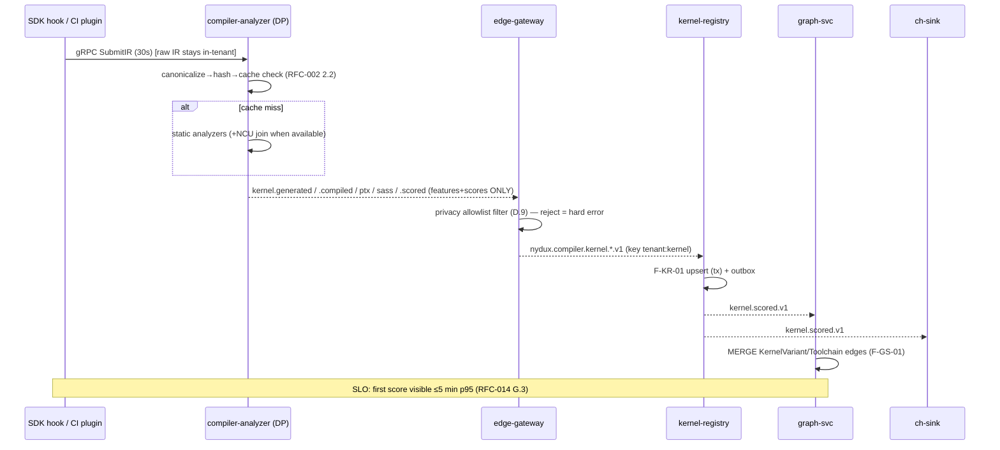

# ECD-005 — Sequence Specifications

**Level:** 2 · Extends RFC-001/002/005/008, RFC-010 K.4. Every business flow as an executable-order sequence; message names are the EXACT topic/RPC names from artifacts (`topics.yaml`, protos). Uniform legend: solid = sync RPC (deadline shown), dashed = Kafka event, note = state change.

## 5.1 Cluster onboarding & collector registration
```mermaid
sequenceDiagram
  actor U as Tenant admin
  participant UI
  participant API as control-plane-api
  participant TS as tenant-svc
  participant GW as edge-gateway (DP)
  participant CO as collector (DP)
  U->>UI: Register cluster
  UI->>API: POST /v1/clusters (10s)
  API->>TS: CreateCluster (5s)
  TS-->>API: cluster_id + bootstrap token (single-use, 1h)
  UI-->>U: helm install cmd (token embedded)
  U->>GW: helm install nydux-collector
  GW->>API: mTLS bootstrap: exchange token→SPIFFE cert (RFC-009 I.2)
  CO->>GW: NATS local heartbeat
  GW-->>API: gRPC SubmitArtifacts stream open
  Note over API: cluster status=connected; UI live-check flips (K.4 onboarding, TTFHW clock starts)
```

## 5.2 Kernel ingestion → compiler pipeline → KES → graph


## 5.3 Regression check (CI gate) — every REST hop shown
```mermaid
sequenceDiagram
  participant CI as customer CI (nydux CLI)
  participant API
  participant RG as regression-svc
  participant BR as bench-runner
  CI->>API: POST /v1/regressions/checks {from,to,fail_on:"CRI>0.10"} (30s)
  API->>RG: CheckRegressions (25s)
  RG->>RG: static pre-screen classifier per family (F-RG-01 prior)
  opt P(reg)>0.7 families
    RG->>BR: Bench(plan) jobs (async, 202 path if >25s → /v1/jobs/{id})
    BR-->>RG: nydux.compiler.benchmark.completed
  end
  RG->>RG: FleetCRI (F-RG-02), Gate.Eval (F-RG-03)
  RG-->>API: {fleet_cri, gate_passed, regressions[]}
  API-->>CI: 200 + JUnit; CLI exit 0|2
  RG-->>GS: regression.detected.v1 (per family)
```

## 5.4 Recommendation lifecycle: generation → approval → deploy → verify → rollback
```mermaid
sequenceDiagram
  participant RC as recommender
  participant PL as policy-svc
  participant UI
  participant API
  participant AO as agent-orchestrator
  participant BR as bench-runner (verify)
  participant AU as audit-svc
  RC-->>UI: rec.created.v1 (inbox)
  RC-->>PL: rec.created.v1 (pre-check)
  UI->>API: POST /v1/recommendations/{id}/approve {rationale} (10s)
  API->>PL: Decide(policy,input) (F-PL-01, 5s) — fail-closed if block
  API->>API: mint approval token (F-AT-01; approver≠author)
  API-->>AO: rec.approved.v1 (strict order key tenant:rec)
  AO->>AO: deploy.apply tool — requires {rec_id, policy verdict, token} (H.5)
  AO-->>AU: deploy.triggered.v1
  AO-->>BR: rec.applied.v1 → verify job (numerical equivalence + perf)
  alt verify pass
    BR-->>GS: rec.verified.v1 → RESULTED_IN edge; savings-svc picks up
  else regression detected
    BR-->>AO: verify fail → auto-rollback via rollback_token (H.6 rule 4)
    AO-->>AU: deploy.rolledback.v1; rec state=rolled_back
  end
  Note over AU: every hop appended to hash chain (F-AU-01)
```

## 5.5 Simulation & capacity plan
UI → `POST /v1/simulations` (202) → twin-svc dequeues job → F-TW-01 per scenario (grid, deterministic seed, cache by scenario hash) → result blob + `/v1/jobs/{id}` done → UI Pareto render; "promote to plan" → `POST /v1/capacity/plans` → ILP (F in RFC-004 4.5) → plan stored + shadow prices returned.

## 5.6 Cost attribution & savings verification
ts-sink materializes cost_slices ← finance.cost.calculated ← finance-svc (rates × usage joins; parked-slice on missing rate). Monthly: savings-svc loads baseline(frozen_state) → twin replay vs actual demand (F-SV-01) → Shapley per action (F-SV-02) → savings.reported.v1 (strict per-tenant) → ledger + audit + notify; re-anchor flow adds dual co-sign before new baseline version (redlock single-flight).

## 5.7 Agent execution (common loop)
Trigger (event/user) → orchestrator creates Task (budget) → Planner → Executor tool loop (each call: schema-validate server-side, audit args-hash) → Judge (grounding=1.0 required) → if write-class → park `awaiting_approval` → resume on rec.approved.v1 → complete → agent.task.completed.v1 (token counts → finance). Kill-switch flag checked before every tool dispatch.

## 5.8 Background workers (complete list; owner · trigger · idempotency)
outbox-relay (each PG service · 250ms poll · publish-once by row lock) · graph consumers (Kafka · upsert) · materialized-view refresher (hourly · graph-svc) · CH TTL/merges (native) · CA cache invalidator (pubsub kes.model.bump) · audit gap-detector (continuous) · daily chain anchor (audit-svc · object-lock put) · baseline redlock janitor · forecast backtester (weekly) · DR drill (monthly, RFC-011 J.10) · DLQ monitors (per class thresholds in topics.yaml).

## 5.9 Failure-path sequences (normative behaviors)
Gateway link-down: collector→spool(24h)→replay original event_time→analytics watermark absorbs (B.7). Policy-svc down during approve: block-policies fail-closed ⇒ API returns 503 problem `policy_blocked` retryable; warn-policies proceed + audit note. Kafka partition loss: RF=3 failover; consumers resume offsets; strict-order keys unaffected (single partition). Verify-runner noisy node: ErrNoisyNode ⇒ reschedule different node, max 3, then rec state=failed with evidence.
