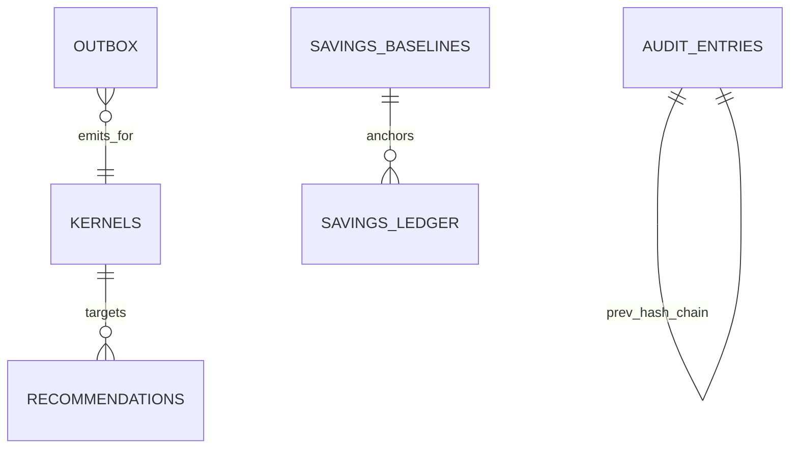

# ECD-006 — Database Construction

**Level:** 2 · Extends RFC-007 (frozen), RFC-001 A.7. **Artifacts are the spec:** production migrations ship in this package — `artifacts/migrations/postgres/0001_init.up.sql` / `.down.sql` / `0002_seed_dev.*`, `artifacts/migrations/timescale/0001_init.up.sql` (Timescale + ClickHouse DDL in one file for review; repo splits CH into `artifacts/migrations/clickhouse/0001_init.sql` executed by clickhouse-migrations). Claude Code copies them verbatim into `services/*/migrations/` per ownership map below.

## 6.1 Migration ownership map (service → tables)
tenant-svc: tenants, clusters, users, roles, user_roles, api_keys · kernel-registry: kernels, toolchains, its outbox · recommender: recommendations · policy-svc: policies · audit-svc: audit_entries · savings-svc: savings_baselines · control-plane-api: jobs · finance/savings: Timescale objects · ch-sink: ClickHouse objects. The single `0001_init` is the bootstrap; subsequent migrations live per-service (expand-contract, RFC-011 J.5). Down migrations exist for every up (0001 down provided; per-service downs required by CI check).

## 6.2 What the shipped DDL adds beyond RFC-007 (all extensions, no changes)
- `FORCE ROW LEVEL SECURITY` (owner can't bypass), `scored_requires_score` CHECK, pattern_id CHECK mirroring the closed set, `frozen_state_hash` column (replay-bundle anchoring, F-SV-01 determinism), `rationale` on recommendations (RFC-010 K.3-8 requirement), outbox table with partial index on unpublished, audit 32-byte hash length checks, money as `bigint` micros everywhere (ASM-002-2).
- Timescale: exact compression segmentby/orderby, retention 25mo, two continuous aggregates with 6h end_offset (watermark alignment, RFC-005 B.7), `savings_ledger` hypertable with per-period uniqueness.
- ClickHouse: replicated engines with keeper paths, cold-volume TTL at 14d + delete at 90d, 1-minute AggregatingMergeTree rollup + MV, 25-month analytic retention, Enum8 status.

## 6.3 Views & stored procedures policy
Views: continuous aggregates (Timescale) and `mv_reg_blast`, `mv_cost_to_kernel`, `mv_top_waste_kernels` (plain PG materialized views in graph-svc schema, hourly refresh — RFC-003 D.10 fallback; refresh function `graph.refresh_mvs()` invoked by worker, not pg_cron, to keep scheduling observable). Stored procedures: NONE for business logic (logic lives in services — testability); the only PL/pgSQL is the RLS-enable DO block and `graph.refresh_mvs()`. Triggers: NONE (outbox pattern replaces audit triggers; explicit code > implicit trigger — decision recorded, alternative rejected: triggers hide write paths from tracing).

## 6.4 Growth estimation & capacity (per 100k-GPU tenant-fleet reference)
| Store | Driver | Rate | 12-mo footprint |
|---|---|---|---|
| CH gpu_samples | 10k rows/s ×~60B compressed | ~2.6 GB/day hot | ≤37 GB rolling (90d) + rollups ~9 GB/yr |
| CH kernel_events | ≤5k kernels/day | trivial | <2 GB/yr |
| TS cost_slices | 1 row/slice/5min × dims | ~0.5 GB/mo compressed | ~6 GB/yr |
| PG control | kernels ≤5M rows, recs ≤100k/yr | — | <20 GB total |
| Graph (PG+AGE) | nodes ~1.2×kernels + edges ~6× | — | <60 GB; OQ-02 trigger at 50M edges |
| Blob (in-tenant IR) | ~50 KB/kernel zstd | — | ~250 GB/yr @5M kernels, lifecycle 12→24mo |
Sizing rule: provision 3× 12-month estimate; ClickHouse NVMe ≥2 TB/node ×2 replicas; PG 500 GB gp3 with autogrow alert at 70%.

## 6.5 Operational construction
- **Vacuum/analyze (PG):** autovacuum on with per-table overrides: `kernels` scale_factor 0.02 (upsert-heavy), `outbox` scale_factor 0.01 + `vacuum_truncate on` (churn); weekly `pg_stat_all_tables` dead-tuple alert >20%.
- **Timescale jobs:** compression/retention policies as in DDL; job-failure alert `timescaledb_information.job_errors`.
- **ClickHouse:** merges monitored (`system.merges`), parts/partition alert >300, `async_insert=1, wait_for_async_insert=1` on sinks; keeper 3-node.
- **Backups (implements RFC-001 A.7):** PG/TS WAL-G archive_timeout 60s (RPO≤5min) + nightly base; CH `BACKUP ... TO S3` incremental nightly + Kafka-replay path; monthly automated restore drill target: full CP restore <1h into `dr` env with checksum verification of audit chain continuity.
- **Sharding:** PG none in V1 (single primary + replicas; partition `audit_entries` by hash of tenant into 16 native partitions at >100 tenants — migration 00NN prepared but not applied); CH sharding by tenant hash when a single shard exceeds 70% NVMe or 60% CPU steady.
- **Seeds:** `0002_seed_dev` (dev/staging only; migrate wrapper refuses in prod env — guard implemented in `make migrate`).

## 6.6 Machine-readable schema manifest
`database-registry.yaml` (generated by tools/genmanifests from migrations — schema source of truth stays SQL; generation at Run 4 per brief, format fixed now): per store → tables → columns{type,nullable,check}, indexes, partitioning, retention, owner service, RLS flag.

## 6.7 ER (delta view; full ER = RFC-007 C.7 + these)

